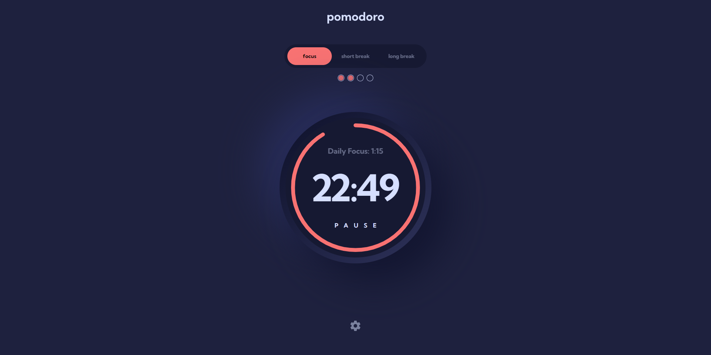

# Pomodoro App

This project is a pomodoro timer, implemented in React. The timer has three modes with customisable durations: focus, short break, and long break, and switches between these modes automatically.

The main reason for building my own pomodoro timer was that I wanted one that tracked total daily focus time — including the time after a focus session ends and before the break timer is started. This helps keep an accurate measure of total focus time, even if you find yourself immersed in your work and ignoring the break timer.

You can access the live app [here](oaktec.github.io/pomodoro-app).

## Features

- **Focus Time Tracking**: Tracks total daily focus time, including the time after a focus session ends and before the break timer is started.
- **Notifications**: Sound and browser notifications when the timer ends.
- **Automatic Mode Switching**: The timer automatically switches between focus and break modes, enabling a seamless work-flow.
- **Window Title Updates**: The window title dynamically updates with the time remaining and the current mode.
- **Responsive Design**: Looks great on both desktop and mobile.
- **Persistence**: Uses local storage to save settings and focus time.

## Design

The initial design for this application was based on a figma file from a challenge on [Frontend Mentor](https://www.frontendmentor.io/challenges/pomodoro-app-KBFnycJ6G).
